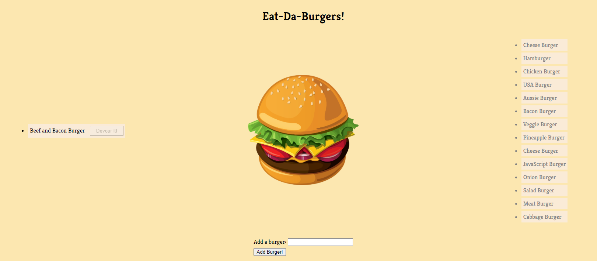

  # Burger Logger

  ## Description
  

  a simple project made using MySQL, node, Express, Handlebars and a homemade ORM to demonstrate the Model View Controller (MVC) design pattern

  ## Table of Contents  
  [Installation](#Installation)   
  [License](#License)  
  [Contributing](#Contributing)  
  [Tests](#Tests)  
  [Questions](#Questions)  
   

  ## Installation
  *requires node CLI*  clone repo, open project in console and run npm i to install dependencies, run schema.sql located in db/ to setup the database then npm start to run application. 

  ## License
  MIT

  ## Contributing
  No

  ## Tests
  N/A
  ## Demo
  

  ## Questions

  #### Github: ldipaola
  #### Email: ldipaola66@gmail.com
